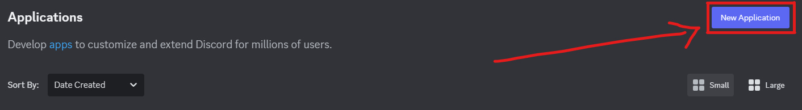
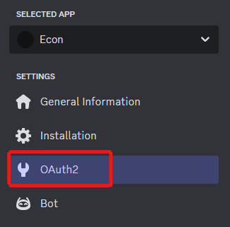
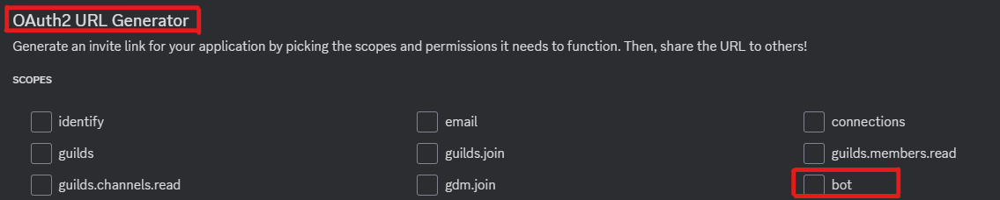
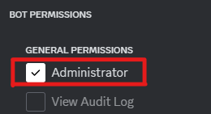
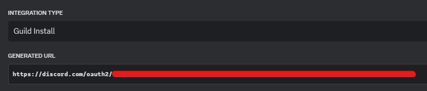
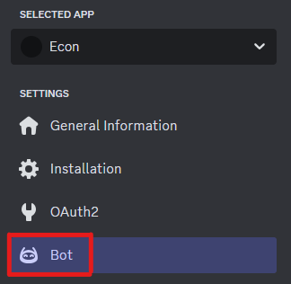
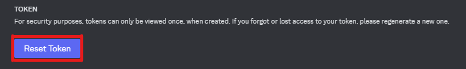
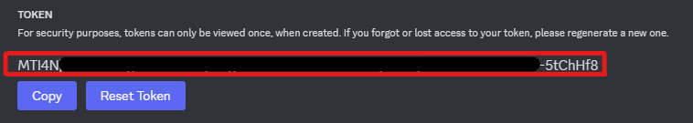

[](https://www.python.org/downloads/release/python-312/)

<div align="center">
  
  <h1 align="center"><strong>ECONBOT</strong></h1>

  <p align="center">
    Simple economy bot for discord.
  </p>

</div>

---
---
---

# Index

+ [Installation](#installation)
  + [Running](#running)
  + [Discord App Deployment](#discord-application-deployment)
+ [Player Manual](#player-manual)
  + [Earning Money](#earning-money)
  + [Day/Night cycle](#day-night-cycle-in-game-time)
  + [Jobs](#jobs)
  + [Market](#markets)
  + [Attributes](#attributes)
  + [Bank Cards](#bank-cards)
  + [Energy Bar](#energy-bar)
  + [Items](#items)
+ [Development Documentation](#dev-docs)
  + [Coding Conventions](#coding-conventions)
  + [UML](#uml)
  + [Directory Structure](#directory-structure)
+ [Authors](#authors)
+ [Customization](#customization) (wip)

---
---
---

<div align="center">
  
</div>

<h1 align="center" id="installation">Installation & Setup</a></h1>

- Clone the repository


```bash
git clone https://github.com/DEVUCP/EconBot
```


- Make sure you have Python 3.12 or higher installed.
  You can check your version with :
```bash
python --version
```

- Install the required dependencies:
```bash
pip install discord
```

## Discord Application Deployment
  

1. Sign into your discord account on the [Discord Developer Portal](https://discord.com/developers/applications)

2. Create a new application by clicking the `New Application` button in the top right of the page.

    

    _After creating your application, it will redirect you to its setting's page._

3. Click the `OAuth2` section.

    

4. Scroll down to the `OAuth2 URL Generator`.

5. Tick on the `Bot` option.

    

    _After that, the URL Generator panel will expand downward._

6. Scroll down to `Bot permissions` and under "General permissions" tick `Administrator`.

    

7. Scroll further down to `Integration type` and make sure its on `Guild Install`

    

8. You may use the Generated URL to invite your bot into your servers.

---

<strong>Token Setup & Environment Variable Setup</strong>

1. Get your bot token from going to the `Bot` section in your application settings.

    

2. Press on `Reset Token` to create your bot token. (__NOTE__: You will only be able to view it once after reseting, otherwise you'll have to reset it again)

    

3. Copy the token (its a bunch of random characters).

    

4. Set up an environment variable named `econtoken` and value as your token that you copied (here are some video tutorials...)

   [Windows 10](https://www.youtube.com/watch?v=z84UIZy_qgE)

   [Windows 11](https://www.youtube.com/watch?v=ow2jROvxyH4&t=2s)

   [Linux (Ubuntu)](https://www.youtube.com/watch?v=Y6_7xaxkPik)

_Alternatively_ you can just directly paste the bot token into the code; however, this is __not recommended__.

- To do this, go to the file `main.py` and on the last line you should see
```py
singletons.client.run(os.getenv("econtoken"))
```
- Replace it with this instead. (paste your token in place of the `YOUR TOKEN HERE`)
```py
singletons.client.run("YOUR TOKEN HERE")
```

## Running

- Open up terminal
- Make sure you're in the root directory (the folder you just cloned)

<note style="font-size: 1.25em;">Note : You will have to run and terminate the bot process <strong>once</strong> to generate the save file so the bot will work.
</note>

- Run the bot using
  ```bash
  py main.py
  ```
- You can terminate it by pressing `CTRL + C` in the terminal you ran it in.

Running and terminating the first time will generate a `userdata.pkl` file in `saveload` directory which is necessary for the bot to work.

Run again after that and you should be good to go.

---
---
---


<h1 align="center" id="player-manual">Player Manual</h1>

<div align="center">A Guide for players for how to play the game~</div>

## Earning Money

<h3>Work</h3>

You can earn money and employability with `$work` command. You make different amount of money depending on your occupation.

<h3>Crime</h3>

You can alternatively earn more money on average with `$crime`, but this will decrease your employability.

<h3>Beg</h3>

Finanlly, you can earn little money on average with `$beg`, this will decrease your employability, but not as much as crime.


## Day-Night cycle (in-game time)

Every `1 minute` that passes in real life is equal to `1 hour` in game.

For now what time or day it is doesn't really affect gameplay whatsoever, but could be implemented easily using `utils.py` module.

## Markets

Doing the market command will display the normal __Market__ and a drop-down menu, where you could buy from the __Black Market__.

You can go to any page from the black market or normal market by just adding the page number in the command -> `$market 3` *(will display 3rd page of normal market)*


## Bank Cards

Your bank card determines the maximum you're allowed to deposit into your bank account.

To upgrade your card:
1. Max out your current card by depositing to its limit
2. Use the `$balance` command
3. Click the green __"Upgrade Card!"__ button that appears

## Jobs

You can check available jobs with `$jobs` command.

Every in-game __week__ avaialble jobs will change. You can only apply to those in that listing with `$apply <job name>`

## Attributes

All they're used for at the moment is job requirements

__Strength__ -> Can be increased with `$workout`

__Dexterity__ -> Can be increased with `$paint`

__Intelligence__ -> Can be increased with `$study`

__Charisma__ -> Can be increased with `$socalize`

__Creativity__ -> Can be increased with `$paint`

__Employability__ -> Can be increased by working (`$work`)


## Energy Bar

The main limiter with advancing in the game. You're supposed to tactically use your energy.

You gain __1__ energy every in-game hour __from the last time you've expended an energy slot__.

You can check your bar with `$profile` or `$energy` if you want to just see your energy.

## Items

Items can be bought in the markets, each can have a unique usage.

You can __buy items for their selling price__, but be careful- because __you sell them for a loss!__

---
---
---

<h1 align="center" id="dev-docs">Development Documentation.<h1>

## UML

class structure can be found in `UML claas diagrams.pdf` (__NOT UPDATED__)


## Coding conventions


- Folder & file names should be lowercase and `flatcase`.
- Any non-const variables should be in `snake_case`.
- Add comments to the code that explain the purpose of the code, not what it does.

- All `const` variables should be in `MACRO_CASE`.
- All Classes and Methods should be in `PascalCase`. Example: `GetAccountID()`.
- Make sure to use XML documentation with every function.


## File saving

Saving **ONLY** occurs when bot's run is terminated. Generates a `'savedata.pkl'` file in `saveload/` directory.

Saving is done via python's `pickle` module.

See [pickling](https://docs.python.org/3/library/pickle.html) documentation for more info.


## Directory structure

```py
.
├── assets/                     # Contains image files for the project
│   ├── icon.png
│   └── installation_banner.gif
│
├── commands/                   # Holds command-related modules
│   ├── apply.py
│   ├── bank.py
│   │
│   ├── display/                # Modules for displaying information
│   │   ├── balance.py
│   │   ├── clock.py
│   │   ├── help.py
│   │   │
│   │   ├── interactables/      # Interactive display components
│   │   │   └── itemlists.py
│   │   │
│   │   ├── inventory.py
│   │   ├── jobs.py
│   │   ├── markets.py
│   │   └── profile.py
│   │
│   ├── earnings.py
│   ├── inventory.py
│   └── training.py
│
├── econ/                       # Economy system modules
│   ├── attribute.py
│   ├── bank.py
│   │
│   ├── cards/
│   │   └── bankcard.py         # Bank card related modules
│   │
│   ├── energy.py
│   │
│   ├── items/                  # Item-related modules
│   │   ├── item.py
│   │   └── items.py
│   │
│   ├── jobs/                   # Job-related modules
│   │   ├── job.py
│   │   ├── jobs.py
│   │   └── listings.py
│   │
│   └── user.py
│
├── saveload/                   # Save and load functionality, also holds the generated save file.
│   └── saveload.py
│
├── constants.py
├── main.py
├── README.md
├── singletons.py
└── utils.py

```
---
---
---

# Authors

- [@TheUCP](https://github.com/OH221105)
- [@OmarSherif](https://github.com/OmarSherif06)
- [@CoolEZFoxy](https://github.com/CoolEZFoxy)

---
---
---
